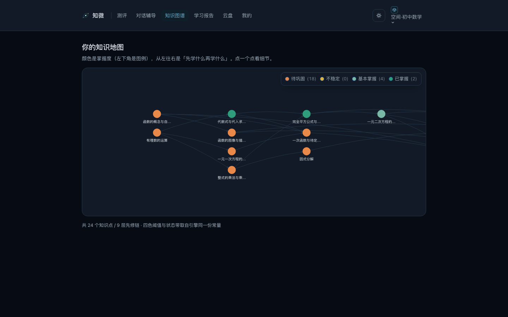
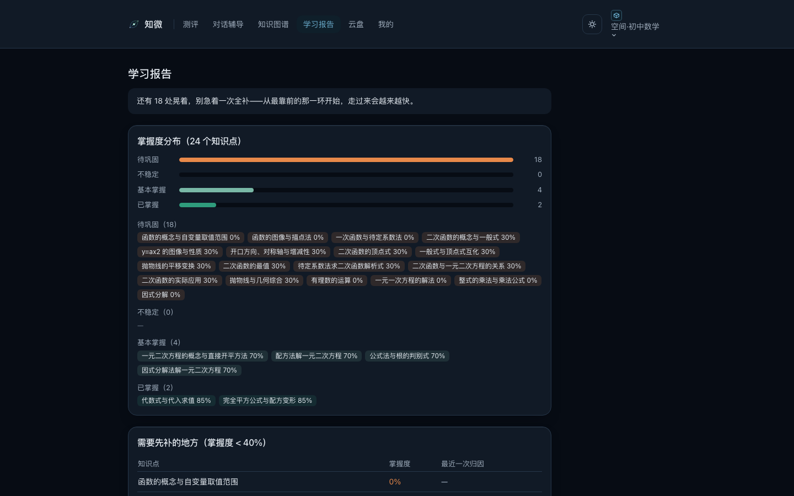
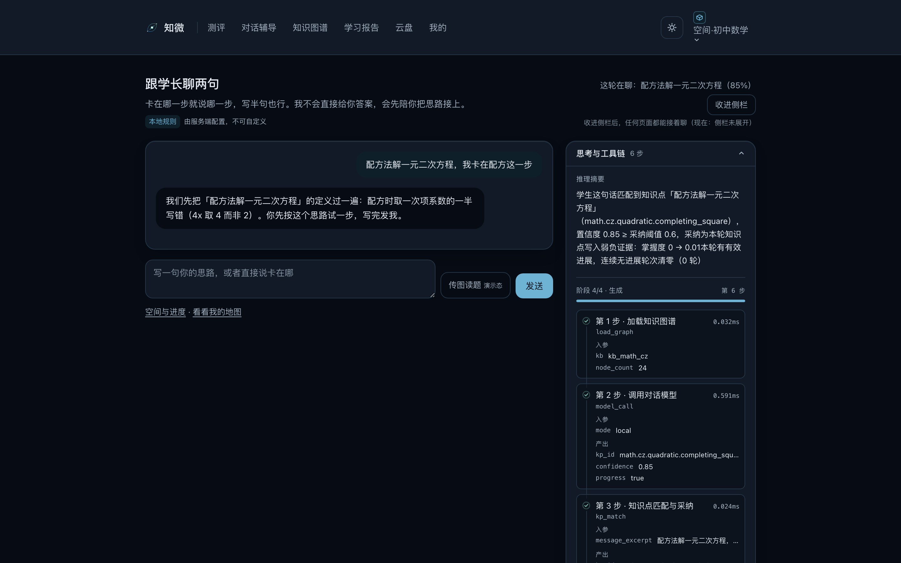
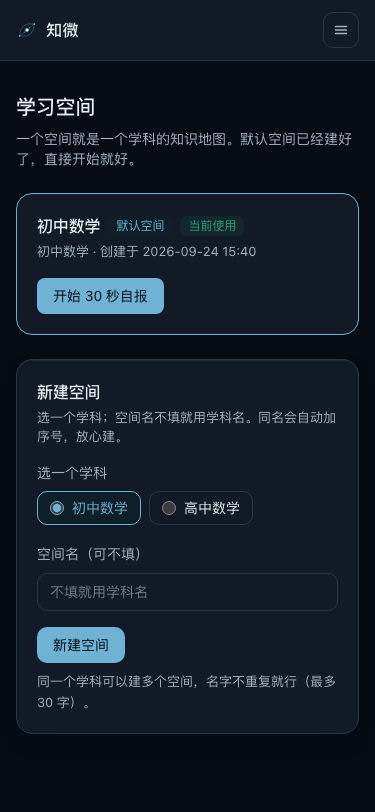
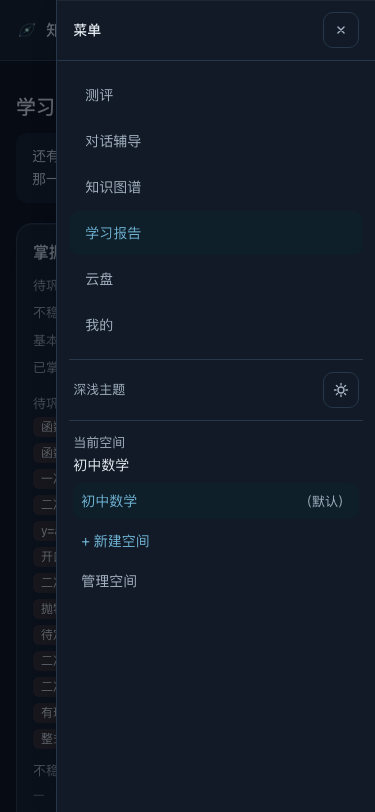

<div align="center">


# 知微 · ZhiWei

**基于知识图谱归因的一对一 AI 学习伴侣**

采集证据 → 诊断掌握度 → 定位根因 → 生成处方 → 新题验证


**粤港澳大湾区 AI Coding 创新赛 · 参赛作品**

**在线体验：[https://zhiwei.imerryou.com](https://zhiwei.imerryou.com)**（注册即用，数据本地隔离）


</div>

---

## English Overview

**ZhiWei** is a one-on-one AI learning companion for junior-high mathematics, built around **knowledge-graph attribution**. Drill apps answer *"what did you get wrong?"*; ZhiWei answers the harder question — *"which knowledge node are you actually stuck on, and what kind of error is it?"*

The product is a five-step closed loop: **collect evidence → diagnose mastery → locate root cause → prescribe intervention → verify with unseen items**. Mastery is modeled with **Bayesian Knowledge Tracing**; root causes are located by backtracking the prerequisite chain of a hand-curated knowledge graph; the tutor chat follows a Socratic policy (one small hint at a time, never dumping the answer). The loop is closed by **ΔAccuracy** — a post-intervention retest drawn from a disjoint item pool, so the effect is measured, not asserted.

Monorepo: React 18 + TypeScript + Vite front end, a Node.js API surface of **20 REST/SSE endpoints**, and a **pure-functional, zero-IO BKT engine**. Data assets: **36 knowledge nodes**, **149 typical errors**, **404 calibrated items** across two curricula. **34 test files / 389 cases**, all green. Fully responsive across desktop, tablet and phone (below 720 px the top bar collapses into a hamburger drawer). Built by two students from the College of Computer Science and Software Engineering, Shenzhen University. Live demo: **[https://zhiwei.imerryou.com](https://zhiwei.imerryou.com)**.

---

## 一、为什么做「知微」

「知微」取自**见微知著** —— 从一道错题的细微之处，看见整个知识体系的破绽。

传统刷题产品的逻辑是「哪儿错补哪儿」：二次函数配方出错了，就再刷十道配方的题。但真实课堂里，配方出错的原因至少有四种：**符号意识没建立、运算基本功不牢、概念理解偏差、程序性步骤缺失**。补错了方向，刷再多题也只是把错误练得更熟练。

家长和老师面对的则是另一重困境：一张 78 分的试卷只能说出「孩子二次函数不行」，**说不出具体卡在哪一个知识节点、因哪一类错误**。诊断的粒度，决定了干预的精度。

知微要做的，就是把「感觉不行」变成「精确制导」：

> **每一分丢在哪里 → 归因到哪个知识点 → 属于哪类错误 → 开什么处方 → 用没见过的新题验证是否真的补上了。**

---

## 二、产品闭环：五步教学法的产品化

```
 ┌─────────┐   ┌─────────┐   ┌─────────┐   ┌─────────┐   ┌─────────┐
 │ ① 采集   │   │ ② 诊断   │   │ ③ 归因   │   │ ④ 处方   │   │ ⑤ 验证   │
 │ 多源证据 │ → │ BKT建模  │ → │ 图谱定位 │ → │ 对话辅导 │ → │ 新题复测 │
 └─────────┘   └─────────┘   └─────────┘   └─────────┘   └─────────┘
  自报/测评      动态出题       根因分析       学长式引导     retest 池
  试卷/对话      掌握度状态带    错误分类       一步一引导     零重叠新题
                                                    ↓
                                        ΔAccuracy = 干预效果实测
```

| 步骤 | 学生看到的 | 系统里发生的 |
| --- | --- | --- |
| **① 采集证据** | 「我哪块儿没底」自报卡点、测评答题、拍照传试卷、和 AI 学长聊天 | 四路证据统一入库，按数据通路加权融合 |
| **② 诊断掌握度** | 一道接一道「恰到好处」的题 | BKT 引擎自适应选题：太熟的不问、太生的先铺垫；每个知识点落到掌握度状态带 |
| **③ 定位根因** | 「你不是粗心，是符号意识这一环还晃」 | 沿知识图谱先修链向上游回溯，区分「根因节点」与「表现节点」；错误落到类型学 |
| **④ 生成处方** | 一份看得懂的学习计划 + 一个不直接抛答案的 AI 学长 | 干预方案按状态带生成；对话遵循语气纪律——像耐心的学长，不像评判者 |
| **⑤ 新题验证** | 三道**从没见过**的复测题 | 复测题与训练题**零重叠**；ΔAccuracy 用实测回答「补上了没有」 |

**闭环的灵魂在第五步**：多数产品在「辅导完成」就结束了，知微坚持用不重复的新题做干预后复测——效果不靠感觉，靠 ΔAccuracy。

---

## 三、界面速览

**归因与图谱**：掌握度着色 + 先修链回溯，把「薄弱」落到具体节点与错误类型。



**学习报告**：掌握度分布、待巩固清单与缺口排序，一屏看清该先补哪个。



**对话辅导**：右侧「思考与工具链」面板逐步披露推理依据与工具调用——不是黑箱，每一轮为什么这么引导都看得见。



**手机端**：顶栏在 720 px 以下收起为汉堡抽屉，375 / 414 档页面级横向溢出为 0。

<p>
  
  
</p>

---

## 四、五大核心亮点

### 1. 知识图谱归因，不是题库匹配

每个知识点节点都挂载了**典型错误库**（初中 93 条 + 高中 56 条，共 149 条），每条都有可操作的描述与干预建议。归因输出不是「你薄弱」，而是：

> 你卡在 **B3 对称轴**，大概率属于**概念理解类 · 符号意识缺失**，上游 **A7 配方法** 也有松动。

然后沿图谱检查上游，避免「头痛医头」。

### 2. BKT 认知建模，掌握度是算出来的

采用贝叶斯知识追踪（BKT）：每答一题，该知识点的掌握概率被证据实时更新，落到**四档掌握度状态带**（待巩固 / 不稳定 / 基本掌握 / 已掌握），统一驱动选题、处方、报告与图谱着色。引擎是**纯函数、零 IO** 的 TypeScript 实现，**17 个算法参数全部外置**于 `config/params.json`——调参不动代码，教育学假设全部显式可审计。

### 3. 对话有教育学纪律，远程模型可插可退

AI 学长的每一轮引导都遵循写进代码的纪律：

- **像耐心的学长，不像评判者**——「这一环还有点晃，我们再稳一下」，不说「你掌握很差」
- **一次只给一小步的方向性提示**，学生没明确要完整解法前不抛答案
- **状态机权威**：模型只产出结构化字段，学习路径决策权在确定性服务层，不被大模型自然语言覆盖
- **接得进真模型，也退得回本地**：默认零依赖的本地规则适配器，几行环境变量即可切换 DeepSeek 等 OpenAI 兼容大模型；远程任何失败自动回落本地，**永不白屏**
- **过程可见**：SSE 逐字上屏，并把推理摘要、工具调用（参数 / 结果 / 耗时）作为独立事件下发；连接不可用时降级为非流式 JSON，链路轨迹一并携带

### 4. C 端学习闭环 + 概览并入「我的」，一个工程

- **C 端**：登录 → 学习空间 → 自报 → 测评 → 试卷 → 对话 → 归因 → 图谱 → 报告 → 云盘，共 10 个主链路页面
- **「我的」页**：学习概览（掌握度分布与 KPI）、账号、当前空间、主题与对话模型（只读）
- **多知识库架构**：初中数学（24 节点）与高中数学（12 节点）双库并行，诊断 / 报告 / 对话 / 空间按知识库隔离，可继续扩展学段与学科
- **多学生空间**：一个账号可管理多个学习空间（家长二孩、教师多生场景）

### 5. 效果用硬指标说话

| 指标 | 设计 | 判据 |
| --- | --- | --- |
| **新题正确率提升** | 基线 3 题（retest 池）→ 干预 → 复测 3 题（**与基线零重叠**） | ΔAccuracy ≥ 0.3 且复测正确率 ≥ 0.75 |
| **归因认可率** | 多名学生 ≥15 条归因记录，一线教师逐条判定 | ≥ 75%（冲刺 80%） |

演示数据全程可重置，所有数字以实测为准。

---

## 五、技术架构

```
┌──────────────────────────────────────────────────────────────┐
│  apps/web         React 18 · TypeScript · Vite · Tailwind     │
│                   11 个路由 · HashRouter · Zustand · ECharts   │
│                   响应式三档：桌面 / 平板 / 手机（<720 汉堡抽屉）│
├──────────────────────────────────────────────────────────────┤
│  functions/api    Node.js · 20 个 REST / SSE 接口              │
│                   Store 适配层（本地 JSON ⇄ CloudBase 可切换）  │
│                   ModelAdapter 工厂（本地规则 / 远程大模型）     │
├──────────────────────────────────────────────────────────────┤
│  packages/engine  BKT 引擎 · 纯函数 · 零 IO · 参数全外置        │
├──────────────────────────────────────────────────────────────┤
│  data/            知识图谱 · 题库 · 知识库索引                 │
│  config/          params.json（17 个算法参数）                  │
└──────────────────────────────────────────────────────────────┘
```

**几条刻进工程的硬约束：**

- **答案不下发前端**——`answer` / `solution_steps` 在接口序列化层被硬性过滤，杜绝「F12 看答案」
- **算法零硬编码**——所有阈值、初值、状态带边界只存在于 `config/params.json`
- **状态带唯一来源**——前端四色语义直接复用引擎导出常量，前后端不各写一份阈值
- **幂等语义**——重复提交不重复扣分，同一知识点换一道题仍正常计分
- **首屏轻量**——构建按依赖拆包，业务代码与 React 分离，ECharts 独立 chunk 懒加载，只在图谱页拉取
- **同构部署**——本地开发、CloudBase 云函数、Docker 单容器三种形态同一套代码

---

## 六、数据资产：AI 产品里最贵的部分

AI 应用的壁垒不在界面，在数据。知微的数据资产**全部结构化、可校验、可复用**：

| 资产 | 规模 | 说明 |
| --- | --- | --- |
| 知识图谱 | **36 节点**（初中 24 + 高中 12） | 含先修关系、章节归属、课标出处（`source.standard`）与典型错误挂载 |
| 典型错误库 | **149 条**（初中 93 + 高中 56） | 每条含错误描述与干预建议，归因与对话共用的「弹药库」 |
| 题目银行 | **404 题**（初中 272 / 高中 132） | **train / retest 双池隔离**，复测题与训练题零重叠 |
| 算法参数 | **17 项**外置 | BKT 初值 / 阈值 / 状态带边界，全部可调可审计 |

配套两道质检工序：

- `scripts/validate_data.py` —— 静态数据闸门：数据结构、图谱连通性（DAG）、双池重叠等**负例有牙**的断言
- `scripts/verify_items.py` —— 题库复算：每题答案**逐一重算固化**，杜绝「错题库教错知识」

---

## 七、三分钟跑起来

**环境要求**：Node.js 22+（无其他外部依赖，默认本地规则模型）

```bash
npm install
npm run all          # 一条命令同时拉起后端 :8787 与前端 :5173
```

浏览器打开 **http://127.0.0.1:5173** 即可。

<details>
<summary>常用命令（分步 / 测试 / 校验）</summary>

```bash
# 分步启动
npm run api          # 构建并启动后端（:8787，可用 ZHIWEI_API_PORT 覆盖）
npm run dev          # 前端开发服务器（:5173，/api 已代理到 8787）

# 测试（可分批跑）
npm test

# 类型检查（三段）
npm run typecheck:all

# 静态数据闸门 + 题库复算
python3 scripts/validate_data.py
python3 scripts/verify_items.py

# 前端构建
npm run build:web
```

</details>

**接真模型（可选）**：在环境变量里把 `ZHIWEI_MODEL_MODE` 置为 `remote` 并填入 OpenAI 兼容接口的地址、模型名与密钥，即可切换到 DeepSeek 等大模型；远程失败会自动、干净地回落本地规则模型。完整变量清单见 `.env.example`。

---

## 八、部署到服务器（Docker 单容器）

```bash
cp deploy/zhiwei.env.example deploy/zhiwei.env
# 唯一必改项：ZHIWEI_SERVER_SECRET（openssl rand -hex 32 生成）
docker compose up -d --build
```

打开 `http://<服务器IP>:8080` 即可。

- **形态**：一个容器 = 静态前端 + `/api` 同源流式反向代理，对外仅一个端口（SSE 直通，无缓冲）
- **数据**：用户与作答记录落在 volume，不进镜像；备份 / 恢复命令见教程
- **健康检查**：内置 `/healthz`
- **限制**：单实例部署（JSON 存储无并发锁）；CloudBase 适配器为接口桩

完整教程（含反向代理、备份恢复、真模型配置、常见问题）见 **`deploy/DEPLOY.md`**。

---

## 九、工程质量

这个项目本身就是 **AI 主导开发**的样本——全程由「总控 + 三子 Agent」流水线交付：

```
 planner（只读，出实现计划）→ implementer（照计划实现）→ reviewer（只读审查，出 VERDICT）
        ↑___________________ FAIL 最多回炉 3 轮 ___________________↑
```

| 维度 | 现状 |
| --- | --- |
| 测试 | **34 个测试文件 · 389 个用例全部通过**（引擎 43 + 后端 169 + 前端 177） |
| 类型 | TypeScript 严格模式，三段工程各自 `tsc --noEmit` 全绿 |
| 数据闸门 | 静态校验 + 题库复算全部通过 |
| 契约 | `API_CONTRACT` > `ALGORITHM` > `DATA_SCHEMA` > `PRD` 四层文档**冻结版**驱动，冲突有法可依，变更**追加式留痕** |
| 响应式 | 真浏览器（Chromium CDP）在 **1440 / 1024 / 768 / 720 / 414 / 375** 六档 × 11 页逐页采集溢出量与几何锚点；桌面三档经**逐像素比对**验证零变化 |
| 留痕 | 每个模块完成立即提交，中文提交信息完整记录决策与关键数字 |

---

## 十、项目结构

```
zhiwei/
├─ apps/web/             前端：11 个页面 + 组件 + 状态层 + API/SSE 客户端
│  ├─ src/pages/         主链路 10 页 + me 我的（含学习概览）
│  ├─ src/components/    设计系统组件（含 chat/ 对话视图七件套）
│  ├─ src/stores/        Zustand：认证 / 空间 / 测评 / 归因 / 对话 / 面板 / 主题
│  └─ tests/             18 个测试文件
├─ functions/api/        后端：20 个接口 + Store 适配 + 模型适配
│  └─ tests/             14 个测试文件
├─ packages/engine/      BKT 引擎（纯函数、零 IO）
│  └─ tests/             2 个测试文件
├─ data/                 知识图谱 / 题库 / 知识库索引
├─ config/params.json    17 个算法参数（唯一来源）
├─ scripts/              数据校验与题库复算
├─ tools/                品牌资源与浏览器走查脚本
├─ deploy/               Docker 部署与运维教程
├─ docs/screenshots/     README 配图
└─ _pipeline/            开发流水线产物（计划 / 执行报告 / 审查报告 / 走查截图）
```

---

## 十一、团队

两位成员，均为**深圳大学计算机与软件学院 · 计算机科学与技术**专业学生。

| 成员 | 分工 |
| --- | --- |
| [@Merryou6](https://github.com/Merryou6) | 项目主开发与工程底座：脚手架与冻结契约体系、BKT 引擎（纯函数零 IO）、知识图谱与题库数据及其校验闸门、后端 20 个 REST/SSE 接口（认证 / 空间 / 测评 / 归因 / 报告 / 对话）、测试体系（34 文件 389 用例）、两轮 UI 重构与响应式走查闸门、Docker 部署 |
| [@congming666](https://github.com/congming666) | 模型接入与知识库扩展：远程大模型适配器（OpenAI 兼容协议 / DeepSeek，模式切换工厂 + 失败自动回落本地）、多知识库架构（初中 24 节点 + 高中 12 节点、题库扩至 404 题、按知识库隔离诊断 / 报告 / 对话 / 空间）、一键启动与 e2e 全链路体检脚本、深色设计系统与品牌视觉资产、登录页与前端交互改版 |

---

## 十二、文档导航

| 文档 | 内容 |
| --- | --- |
| [`API_CONTRACT.md`](API_CONTRACT.md) | 20 个接口的冻结契约：路由、字段、错误码、认证、变更记录 |
| [`ALGORITHM.md`](ALGORITHM.md) | 算法规格：参数总表、BKT 三段式、自适应选题、错误诊断、归因定位、退出通道、状态带、复测指标 |
| [`DATA_SCHEMA.md`](DATA_SCHEMA.md) | 数据结构：图谱与题库静态字段规格 + 运行时数据表 + 校验脚本要求 |
| [`PRD.md`](PRD.md) | 范围与验收：P0 清单、页面清单、交互纪律、效果验证指标 |
| [`知微-参赛完整方案-v4.md`](%E7%9F%A5%E5%BE%AE-%E5%8F%82%E8%B5%9B%E5%AE%8C%E6%95%B4%E6%96%B9%E6%A1%88-v4.md) | 完整方案与答辩素材 |
| [`LOOKATME.md`](LOOKATME.md) | 进度快照与交接单 |
| [`AGENT.md`](AGENT.md) | 开发工作流、环境常量、常用命令与代码红线 |
| [`deploy/DEPLOY.md`](deploy/DEPLOY.md) | Docker 单容器部署与运维教程 |

---

## 十三、许可证

本项目以 **GNU General Public License v3.0** 发布，详见 [`LICENSE`](LICENSE)。

---

<div align="center">

**知微不生产题海。**

它做的是把「这孩子二次函数不行」翻译成「卡在 B3 对称轴、属于概念类错误、上游 A7 也松了」，
然后用一个不抛答案的 AI 学长陪他走回正轨，
**最后用三道从没见过的新题，证明这条路走对了。**

</div>
